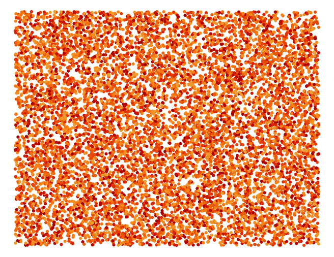
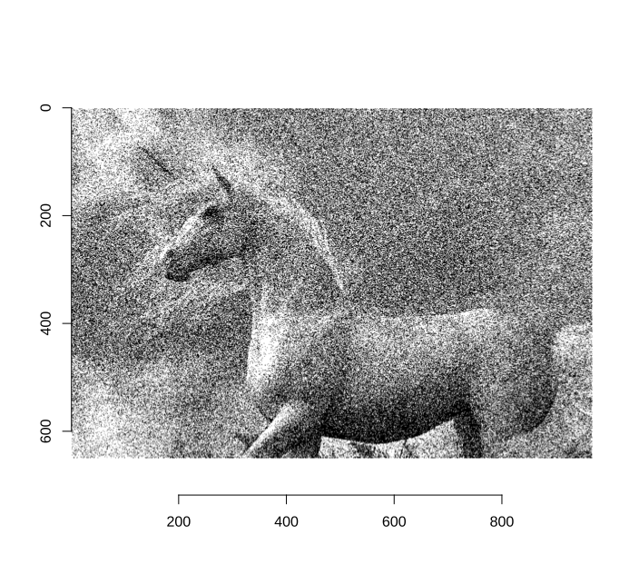
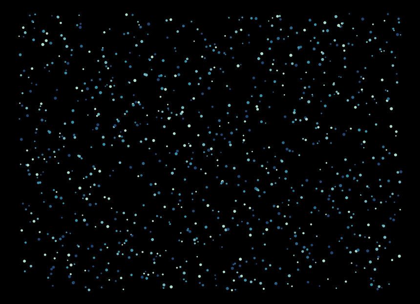
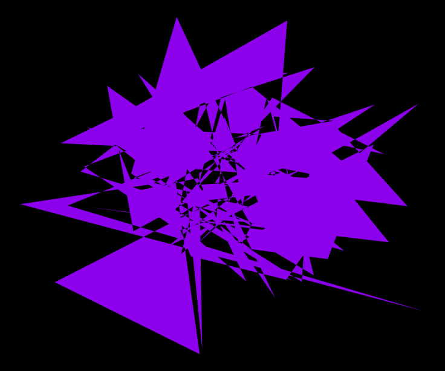
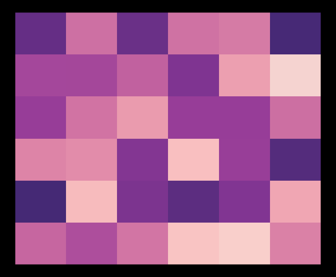
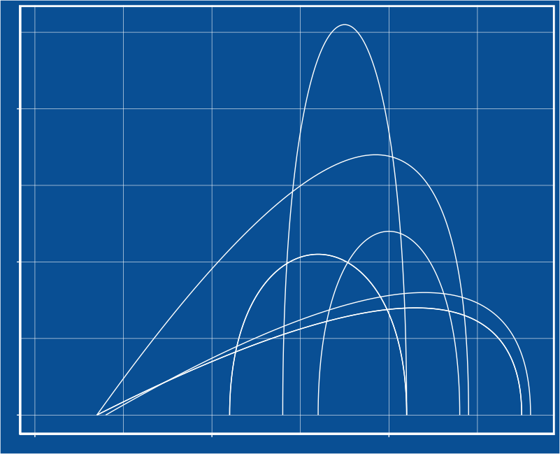
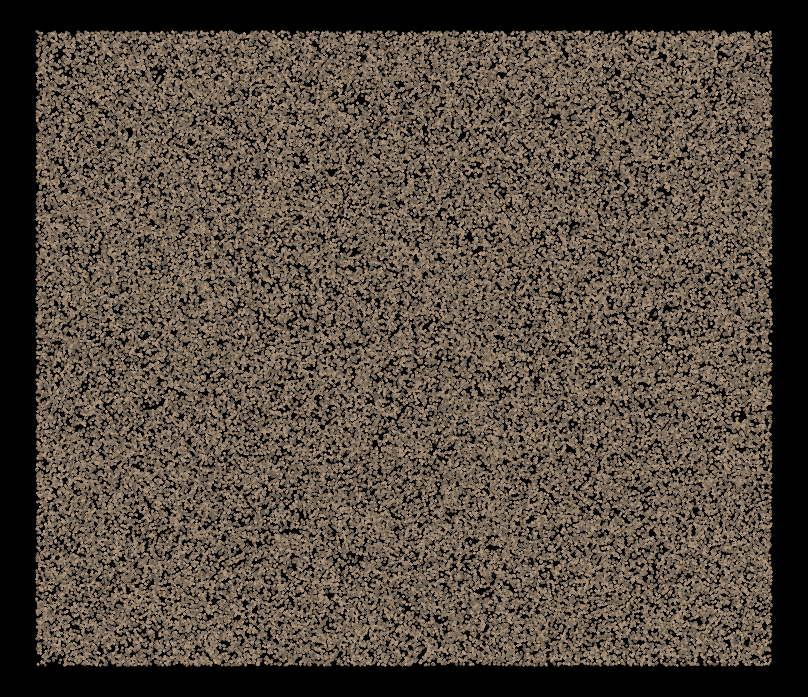
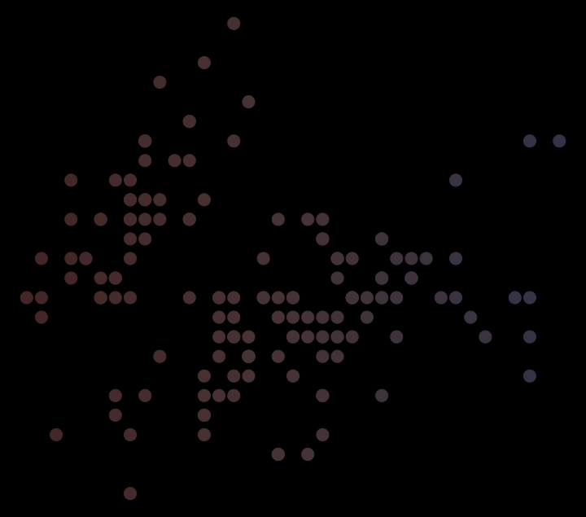
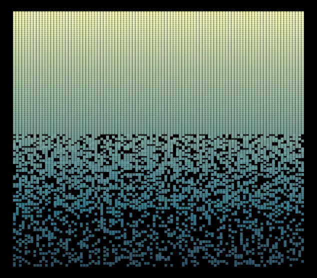

# genuary-2022
my first #genuary R repo

https://genuary.art/prompts 

## day 1

## day 2

## day 3

## day 4

## day 5

## day 6 

## day 7 

## day 8

## day 9

## day 10 

## day 11 - no computer

## day 12 

## day 13

## day 14

## day 15 - sand

## day 16 

## pixels :: 

